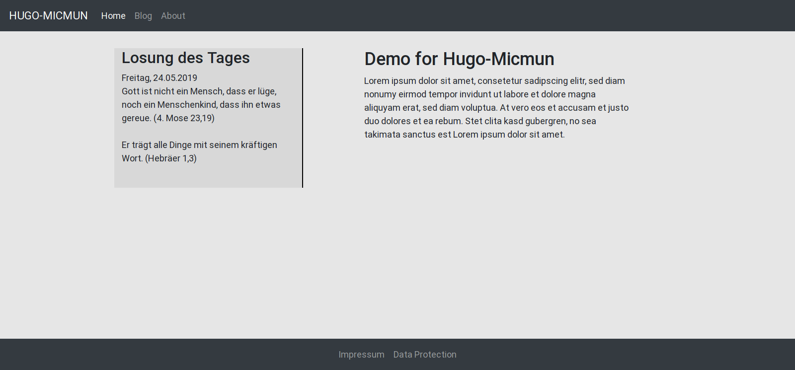

# hugo-micmun
A personal theme for my website and blog (Micmun-Style). Made for the hugo static site generator (https://gohugo.io/).

## Description

The theme shows on the start the "Losung" of the day left of the content.
There is a main menu and a footer menu.

You can integrate a blog and static sites in one website.

## Credits

Integrated in the theme:

- [Hugo-Easy-Gallery](https://github.com/liwenyip/hugo-easy-gallery)
- [Bootstrap 4.3.1](https://getbootstrap.com/)
- [jQuery 3.4.1](https://jquery.com/)
- [Popper js](https://popper.js.org/)
- [Herrnhuter Losungen](https://www.losungen.de/die-losungen/)

## License

Copyright 2019 MicMun.

Licensed to the Apache Software Foundation (ASF) under one or more contributor license agreements. See the NOTICE file distributed with this work for additional information regarding copyright ownership. The ASF licenses this file to you under the Apache License, Version 2.0 (the "License"); you may not use this file except in compliance with the License. You may obtain a copy of the License at

http://www.apache.org/licenses/LICENSE-2.0

Unless required by applicable law or agreed to in writing, software distributed under the License is distributed on an "AS IS" BASIS, WITHOUT WARRANTIES OR CONDITIONS OF ANY KIND, either express or implied. See the License for the specific language governing permissions and limitations under the License.
